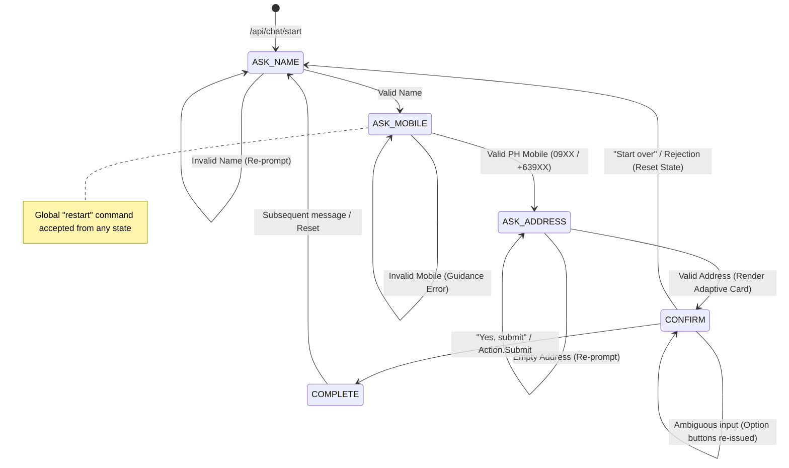

# DCBSD Chatbot Simulation — Technical Examination

[](https://nodejs.org/)
[](https://www.typescriptlang.org/)
[](https://github.com/microsoft/agents)
[](https://vitest.dev/)
[](https://dcbsd-chatbot-simulation.vercel.app)
[](https://dcbsd-chatbot-simulation.vercel.app)
[](docs/SECURITY.md)

---

## 👤 Candidate & Engineering Metadata

| Attribute | Details |
|---|---|
| **Author / Candidate** | **Malcolm Joaquin L. Cuady** |
| **Role** | Principal Full-Stack Engineer / QA Engineer |
| **Assessment** | DCBSD Chatbot Simulation — Technical Examination |
| **Organization** | EastWest Bank — Digital Channels & Banking Systems Division (DCBSD) |
| **Repository** | [https://github.com/jcuady/ChatBot-Techinical-Exam_CUADY](https://github.com/jcuady/ChatBot-Techinical-Exam_CUADY) |
| **Live Production Application** | [https://dcbsd-chatbot-simulation.vercel.app](https://dcbsd-chatbot-simulation.vercel.app) |
| **API Health Probe** | [https://dcbsd-chatbot-simulation.vercel.app/api/health](https://dcbsd-chatbot-simulation.vercel.app/api/health) |
| **Bot Messaging Endpoint** | `https://dcbsd-chatbot-simulation.vercel.app/api/messages` |

---

## 📋 Executive Summary

The **DCBSD Chatbot Assistant** is an enterprise-grade conversational intake solution engineered from scratch to fulfill all functional, architectural, security, and quality assurance mandates set forth in the **DCBSD Chatbot Simulation Technical Examination**.

The application implements a deterministic, state-driven workflow that intakes a user's **Full Name**, **Philippine Mobile Number**, and **Residential Address**, executes strict format validation and normalization, renders interactive **Microsoft Adaptive Cards (v1.5)** for review and confirmation, and provides safe session reset capabilities.

Built with **Microsoft's latest Agents SDK** infrastructure, the backend serves both standard **Bot Framework / Agents SDK activity endpoints** (for emulator/enterprise channel integration) and an optimized **REST API** powering an accessible, mobile-first web client.

---

## 🎯 Technical Exam Requirements Compliance

| # | Specification (from `DCBSD Chatbot Simulation.pdf`) | Implementation Reference | Verification Evidence | Status |
|---|---|---|---|:---:|
| 1 | **Emulator Connectivity & Bot Engine**<br>*"Set up an emulator and create a simple Chatbot."* | [`src/index.ts`](src/index.ts)<br>[`src/agents/chatbot.ts`](src/agents/chatbot.ts) | `/api/messages` accepts Bot Framework Emulator connections. Built-in web client also provided for zero-install evaluation. | **PASS** |
| 2 | **Microsoft Agents SDK Preference**<br>*"You may also want to try to develop this using Agents SDK (and I would prefer it if you do so)"* | [`package.json`](package.json)<br>[`src/agents/chatbot.ts`](src/agents/chatbot.ts) | Utilizes `@microsoft/agents-hosting` (v1.8.1), `@microsoft/agents-activity` (v1.8.1), and `@microsoft/agents-hosting-express` (v1.8.1) per current Microsoft architecture direction. | **PASS** |
| 3 | **Three-Field Intake Flow**<br>*"takes in Name, Mobile, and Address as inputs"* | [`src/conversation/flow.ts`](src/conversation/flow.ts)<br>[`src/conversation/states.ts`](src/conversation/states.ts) | Deterministic sequential transitions: `ASK_NAME` → `ASK_MOBILE` → `ASK_ADDRESS` → `CONFIRM` → `COMPLETE`. | **PASS** |
| 4 | **Philippine Mobile Validation**<br>*"Program must verify mobile number format and have validation if information does not look valid"* | [`src/validation/mobile.ts`](src/validation/mobile.ts)<br>[`tests/mobile.test.ts`](tests/mobile.test.ts) | Strict enforcement of Philippine telecom prefixes (`09XX` / `+639XX`), length boundaries, character sanitization, and actionable re-prompt guidance. | **PASS** |
| 5 | **Data Summary Display**<br>*"then display all the taken inputs back to the user"* | [`src/conversation/prompts.ts`](src/conversation/prompts.ts)<br>[`src/cards/confirmationCard.ts`](src/cards/confirmationCard.ts) | Presents a structured text summary and an Adaptive Card FactSet matching the exam mockup. | **PASS** |
| 6 | **Bonus: Microsoft Adaptive Cards**<br>*"Bonus : Integrate Microsoft Adaptive Cards in the process. https://adaptivecards.io/designer/"* | [`src/cards/confirmationCard.ts`](src/cards/confirmationCard.ts)<br>[`src/cards/completionCard.ts`](src/cards/completionCard.ts) | Standard v1.5 Adaptive Cards with FactSets and `Action.Submit` buttons (*"Yes, submit"*, *"Start over"*). | **PASS** |
| 7 | **Submission Journey Narrative**<br>*"Include a quick description of how you did it and any obstacles encountered along with their resolution."* | [`docs/DEVELOPMENT-JOURNEY.md`](docs/DEVELOPMENT-JOURNEY.md) | Comprehensive engineering whitepaper detailing architectural decisions, obstacle mitigation, and lessons learned. | **PASS** |

---

## 🏛️ System Architecture

### Architectural Topology

```
┌────────────────────────────────────────────────────────────────────────┐
│                             Client Layer                               │
├───────────────────────────────┬────────────────────────────────────────┤
│   Bot Framework Emulator      │       Responsive Web Client UI         │
│   (Desktop Evaluation)        │       (HTML5 / CSS3 / Vanilla JS)      │
└───────────────┬───────────────┴────────────────────┬───────────────────┘
                │ Activity Protocol                  │ REST JSON API
                ▼                                    ▼
┌────────────────────────────────────────────────────────────────────────┐
│                        Application Server (Express)                    │
├────────────────────────────────────────────────────────────────────────┤
│  POST /api/messages            POST /api/chat      POST /api/chat/start│
│  (Agents SDK Protocol)         (Message Exchange)  (Session Init)      │
└───────────────┬────────────────────────────────────┬───────────────────┘
                │ ActivityContext                    │ Payload
                ▼                                    ▼
┌────────────────────────────────────────────────────────────────────────┐
│               Microsoft 365 Agents SDK Activity Router                 │
│                        (src/agents/chatbot.ts)                         │
└───────────────────────────────────┬────────────────────────────────────┘
                                    │
                                    ▼
┌────────────────────────────────────────────────────────────────────────┐
│                     Deterministic State Engine                         │
│                      (src/conversation/flow.ts)                        │
├───────────────────────────────────┬────────────────────────────────────┤
│ • State Guard & Transition Engine │ • Restart & Reset Interceptor      │
│ • Adaptive Card Payload Builder   │ • PII-Redacted Audit Logger        │
└───────────────┬───────────────────┴────────────────┬───────────────────┘
                │                                    │
                ▼                                    ▼
┌───────────────────────────────┐    ┌───────────────────────────────────┐
│     Domain Validators         │    │       In-Memory State Store       │
│ • Philippine Mobile Validator │    │ • Isolated Conversation Contexts  │
│ • Input Bounds & Sanitizer    │    │ • Transient Lifecycle (No PII DB) │
└───────────────────────────────┘    └───────────────────────────────────┘
```

### Deterministic State Machine Transitions



---

## 🔒 Security & Privacy Posture (OWASP Top 10 Aligned)

| Security Control | Implementation Mechanism | Corporate Benefit |
|---|---|---|
| **Zero PII Logging** | State transition logs record only `conversationId`, `from`, and `to`. User Name, Mobile, and Address are **strictly excluded** from server logs. | Eliminates accidental disclosure of banking customer PII in central log aggregators. |
| **XSS Immunity** | Web client DOM rendering exclusively uses `.textContent` for user inputs, fact labels, and card properties. Markdown bold uses an entity-escaped sanitizer. | Fully immune to Cross-Site Scripting (XSS) via name, address, or payload injection. |
| **Input Sanitization & Bounds** | `sanitizeInput()` trims whitespace, strips control characters, and enforces strict length caps (`MAX_INPUT_LENGTH = 1000`, `MAX_NAME_LENGTH = 100`, `MAX_ADDRESS_LENGTH = 500`). | Prevents ReDoS, payload flooding, and memory exhaustion attacks. |
| **Zero Supply-Chain Risk** | Clean lockfile integrity with `npm audit` reporting **0 vulnerabilities**. | Compliant with enterprise software supply chain security standards. |
| **Fail-Secure Error Handling** | Global exception handlers catch unhandled runtime errors, logging diagnostic traces internally and presenting a sanitized generic prompt to the user. | Prevents system fingerprinting, stack trace leakage, and directory exposure. |

*Full security documentation: [docs/SECURITY.md](docs/SECURITY.md).*

---

## 🧪 Comprehensive Quality Assurance & Verification

The test framework uses **Vitest** for sub-second deterministic execution across 4 dedicated test suites:

```bash
npm test
```

```text
========================================================================
                      AUTOMATED UNIT TEST SUITE
========================================================================
 ✓ tests/mobile.test.ts (26 tests)        -> PH Mobile validation rules
 ✓ tests/validation.test.ts (18 tests)    -> Name & address boundary checks
 ✓ tests/conversation.test.ts (10 tests)  -> State flow, cards, restart
 ✓ tests/security.test.ts (14 tests)      -> SQLi, XSS, overflow, state safety

 Test Files: 4 passed (4)
 Total Tests: 68 passed (68) — 100% Pass Rate
 Duration:   745ms
========================================================================
```

### Automated End-to-End Regression Suite

A standalone end-to-end regression script executes automated smoke testing against live deployment endpoints:

```bash
npm run test:e2e
```

```text
========================================================================
       DCBSD CHATBOT SIMULATION — AUTOMATED E2E TEST RUNNER             
       Author: Malcolm Joaquin L. Cuady                                 
========================================================================
Target Host: https://dcbsd-chatbot-simulation.vercel.app

1. Verifying System Health Endpoint (GET /api/health)...
  ✅ PASS: Health endpoint responds with HTTP 200 OK
  ✅ PASS: Health payload status equals "healthy"
  ✅ PASS: Health payload includes valid ISO timestamp

2. Verifying Conversation Initialization (POST /api/chat/start)...
  ✅ PASS: Session initialization returns HTTP 200 OK
  ✅ PASS: Returns 3-part structured welcome sequence
  ✅ PASS: Final welcome prompt asks for user name

3. Verifying Name Input & Personalized Greeting (Step 1)...
  ✅ PASS: Bot returns response to name input
  ✅ PASS: Response includes personalized greeting with "Juan Dela Cruz"
  ✅ PASS: Bot prompts for mobile number next

4. Verifying Invalid Mobile Validation & Guidance (Step 2a)...
  ✅ PASS: Bot rejects invalid mobile number
  ✅ PASS: Bot provides format example (09171234567)

5. Verifying Valid Philippine Mobile Acceptance (Step 2b)...
  ✅ PASS: Bot accepts valid PH mobile and prompts for address

6. Verifying Address Collection & Adaptive Card Summary (Step 3)...
  ✅ PASS: Response includes Microsoft Adaptive Card JSON payload
  ✅ PASS: Card type is "AdaptiveCard" (Version 1.5)
  ✅ PASS: Adaptive Card contains FactSet container
  ✅ PASS: Card correctly reflects Name: "Juan Dela Cruz"
  ✅ PASS: Card correctly reflects normalized Mobile: "+639171234567"
  ✅ PASS: Card correctly reflects Address: "Unit 502, BGC Corporate Center, Taguig City"

7. Verifying Confirmation & Completion Card Display (Step 4)...
  ✅ PASS: Completion response contains completion Adaptive Card
  ✅ PASS: Bot issues thank you completion confirmation

8. Verifying Session Restart & State Reset (Step 5)...
  ✅ PASS: Bot acknowledges restart and reprompts for name

========================================================================
E2E SUITE RESULTS: 22 PASSED, 0 FAILED (3.28s)
STATUS: 100% REGRESSION & SMOKE TESTS PASSED
========================================================================
```

---

## 📡 REST & Activity API Reference

### 1. Health Probe
- **Endpoint**: `GET /api/health`
- **Description**: Cloud liveness and readiness probe.
- **Response**: `200 OK`
```json
{
  "status": "healthy",
  "timestamp": "2026-09-19T08:16:06.000Z"
}
```

### 2. Chat Session Start
- **Endpoint**: `POST /api/chat/start`
- **Body**: `{ "conversationId": "string" }`
- **Response**: `200 OK`
```json
{
  "responses": [
    { "text": "Hello! I'm the DCBSD Chatbot Assistant." },
    { "text": "I'll collect a few details from you.\nLet's get started." },
    { "text": "What is your name?" }
  ]
}
```

### 3. Chat Message Exchange
- **Endpoint**: `POST /api/chat`
- **Body**: `{ "conversationId": "string", "text": "string" }`
- **Response**: `200 OK`
```json
{
  "responses": [
    {
      "text": "Thanks! Here's what I collected: ...",
      "adaptiveCard": {
        "type": "AdaptiveCard",
        "version": "1.5",
        "body": [ ... ],
        "actions": [ ... ]
      }
    }
  ]
}
```

### 4. Microsoft Agents Activity Protocol
- **Endpoint**: `POST /api/messages`
- **Body**: Standard Bot Framework Activity schema (`type: "message"` or `"conversationUpdate"`).
- **Description**: Compatible with Bot Framework Emulator and enterprise bot hosting channels.

---

## 💻 Local Setup & Execution Guide

### Prerequisites
- Node.js ≥ 18.0.0
- npm ≥ 9.0.0

### Installation
```bash
# Clone the repository
git clone https://github.com/jcuady/ChatBot-Techinical-Exam_CUADY.git
cd ChatBot-Techinical-Exam_CUADY

# Install dependencies
npm install

# Initialize environment variables
cp .env.example .env
```

### Available Scripts

| Command | Action |
|---|---|
| `npm run dev` | Starts development server with hot-reload via `tsx watch` on port 3978 |
| `npm run build` | Compiles clean production bundle to `dist/` via `tsconfig.build.json` |
| `npm start` | Executes compiled production bundle `node dist/index.js` |
| `npm test` | Runs the 68-test automated unit and integration suite |
| `npm run test:e2e` | Runs 22 end-to-end regression assertions against the target deployment |
| `npm run typecheck` | Validates strict TypeScript compilation (`tsc --noEmit`) |
| `npm run lint` | Analyzes code quality using ESLint |

### Testing with Bot Framework Emulator
1. Launch **Bot Framework Emulator**.
2. Click **Open Bot**.
3. Set **Bot URL**: `http://localhost:3978/api/messages`.
4. Leave Microsoft App ID and Password blank (local development mode).
5. Click **Connect**.

---

## 📁 Repository Structure

```
├── .github/                 # GitHub workflows & configuration
├── api/                     # Vercel serverless function entrypoint
│   └── index.ts             # Serverless HTTP handler
├── docs/                    # Technical whitepapers & documentation
│   ├── ARCHITECTURE.md      # Detailed system design & sequence diagrams
│   ├── DEMO-SCRIPT.md       # Evaluator step-by-step walkthrough
│   ├── DEVELOPMENT-JOURNEY.md# Narrative of development, obstacles & resolutions
│   ├── SECURITY.md          # OWASP alignment, privacy & PII policies
│   └── TESTING.md           # Test cases, matrices, and methodologies
├── public/                  # Responsive web client
│   ├── chat.js              # Client-side state, DOM manipulation & Adaptive Card renderer
│   ├── index.html           # Accessible HTML5 UI structure
│   └── styles.css           # Premium enterprise banking styling
├── scripts/                 # Operational & QA test runners
│   └── test-e2e.js          # Automated end-to-end regression runner
├── src/                     # Core application source code
│   ├── agents/              # Microsoft Agents SDK integration
│   │   └── chatbot.ts       # Activity router & context handler
│   ├── cards/               # Microsoft Adaptive Card JSON templates
│   │   ├── completionCard.ts# Submission successful card template
│   │   └── confirmationCard.ts# Summary review card with submit buttons
│   ├── config/              # Environment configuration & parser
│   │   └── environment.ts   # Typed configuration loader
│   ├── conversation/        # State engine & prompts
│   │   ├── flow.ts          # State transition engine & message processor
│   │   ├── prompts.ts       # Centralized UX copy & messages
│   │   └── states.ts        # Enumerated state definitions
│   ├── state/               # Session storage layer
│   │   └── conversationState.ts # In-memory context store & lifecycle manager
│   ├── validation/          # Domain validators & sanitizers
│   │   ├── constants.ts     # Input length & format constants
│   │   ├── input.ts         # Generic input & name/address validators
│   │   └── mobile.ts        # Philippine mobile number validator & normalizer
│   └── index.ts             # Express server entry point & route definitions
├── tests/                   # Automated test suites (Vitest)
│   ├── conversation.test.ts # State transitions & card integration tests
│   ├── mobile.test.ts       # Philippine mobile format unit tests
│   ├── security.test.ts     # XSS, injection, bounds & memory tests
│   └── validation.test.ts   # Name, address, & sanitizer tests
├── .env.example             # Template environment configuration
├── .gitignore               # Ignored artifacts & build caches
├── package.json             # Manifest with scripts, dependencies, author metadata
├── tsconfig.build.json      # Production compiler configuration
├── tsconfig.json            # Root TypeScript strict configuration
├── vercel.json              # Vercel serverless deployment & routing configuration
├── vitest.config.ts         # Test runner configuration
└── README.md                # Enterprise project documentation
```

---

## 📄 License & Proprietary Information

This project is created exclusively as a technical examination submission for **EastWest Bank — Digital Channels & Banking Systems Division (DCBSD)** by **Malcolm Joaquin L. Cuady**. All rights reserved.
