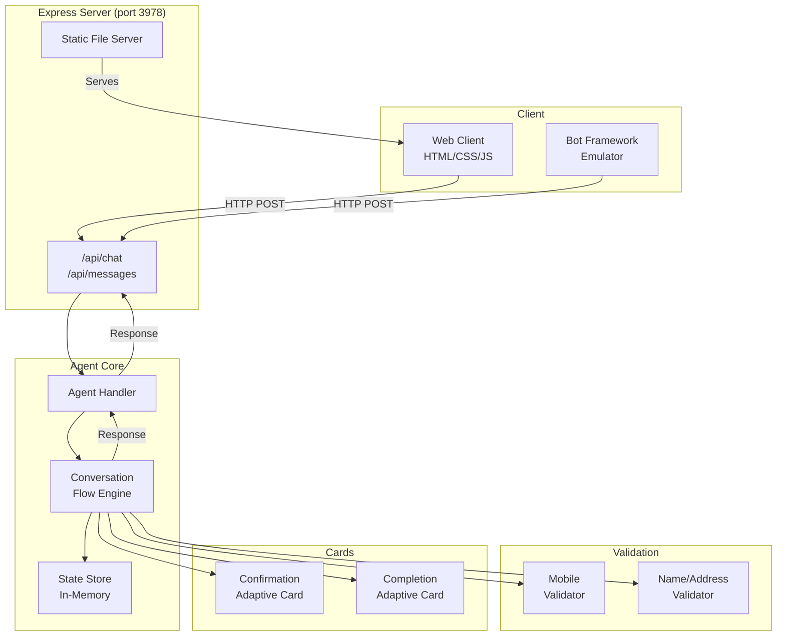
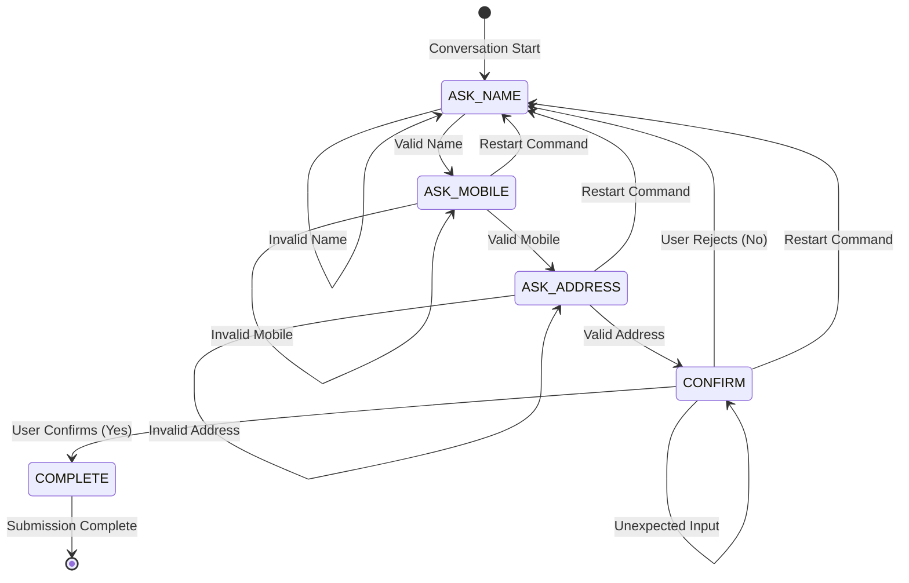

# Architecture

## Overview

The DCBSD Chatbot is a deterministic conversational intake application that collects user information through a structured state machine. It is built on the Microsoft 365 Agents SDK with TypeScript and Express.

## Component Diagram



## State Machine



## Key Design Decisions

### 1. Explicit State Machine

The chatbot uses an explicit enum-based state machine rather than nested conditionals or dialog trees. This makes state transitions:
- **Predictable** — every possible transition is documented
- **Testable** — each state can be tested independently
- **Auditable** — state transitions are logged without PII

### 2. Isolated Validation

The mobile number validator (`src/validation/mobile.ts`) is completely independent of the conversation flow. This separation means:
- Validation logic can be unit-tested without spinning up a conversation
- The validator can be reused in other contexts
- Validation rules can be updated without touching flow logic

### 3. Adaptive Cards

Adaptive Cards are generated from structured data at the confirmation and completion steps. The card JSON is created server-side and rendered by the client, ensuring:
- Consistent display across different clients
- Server-controlled content (no client-side template injection)
- Bot Framework Emulator compatibility

### 4. Transient State

Conversation state is stored in-memory using a simple `Map<string, ConversationState>`. This is appropriate because:
- The exam does not require persistent storage
- No customer data survives a server restart
- Production deployment would use an approved persistent state mechanism

## Data Flow

```
User Input → sanitizeInput() → State Machine Switch
  → validateName() / validateMobileNumber() / validateAddress()
  → Update State → Generate Response(s)
  → Send to Client (text + optional Adaptive Card)
```

## Security Boundaries

| Boundary | Protection |
|----------|-----------|
| Client → Server | Input sanitization, length limits |
| Server → Client | Safe error messages, no PII in errors |
| Server → Logs | No PII logged, structured events only |
| Server → State | Cleared on restart, keyed by conversation ID |

## Module Responsibilities

| Module | Responsibility |
|--------|---------------|
| `src/index.ts` | Express server, routing, static serving |
| `src/agents/chatbot.ts` | SDK activity handling, error boundaries |
| `src/conversation/flow.ts` | State machine transitions |
| `src/conversation/states.ts` | Type definitions, enums |
| `src/conversation/prompts.ts` | All user-facing text |
| `src/validation/mobile.ts` | Philippine mobile validation |
| `src/validation/input.ts` | Name and address validation |
| `src/state/conversationState.ts` | In-memory state store |
| `src/cards/*.ts` | Adaptive Card JSON generators |
| `src/config/environment.ts` | Environment validation |
