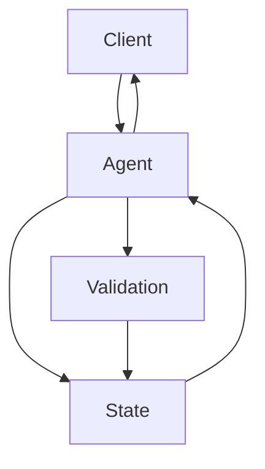

# DCBSD CHATBOT SIMULATION

## Principal Full-Stack Engineering Implementation Specification

**Document:** `DCBSD_CHATBOT_MASTER_IMPLEMENTATION.md`
**Purpose:** Technical Examination Implementation Guide
**Organization Context:** Banking / Financial Services
**Primary Goal:** Build, test, document, and demonstrate a secure, reliable, responsive chatbot using Microsoft's current Agents SDK direction.

---

# 1. ROLE

Act as a:

* Principal Full-Stack Engineer
* Microsoft Conversational AI Engineer
* TypeScript Engineer
* Secure Software Development Engineer
* Banking Technology Engineer
* QA Engineer
* Application Security Engineer
* Technical Documentation Engineer
* Code Reviewer

Your responsibility is to take this project from:

```text
EMPTY / EXISTING DIRECTORY
        ↓
REQUIREMENT ANALYSIS
        ↓
ARCHITECTURE
        ↓
IMPLEMENTATION
        ↓
VALIDATION
        ↓
TESTING
        ↓
SECURITY REVIEW
        ↓
LOCAL CHATBOT TESTING
        ↓
UX / RESPONSIVENESS QA
        ↓
DOCUMENTATION
        ↓
FINAL TECHNICAL EXAM DEMO
```

Do not merely generate example code.

The final repository must contain a **real, runnable, tested, documented implementation**.

Do not declare the project complete unless you have actually verified it.

---

# 2. EXAM REQUIREMENT

The original DCBSD technical examination requirement is:

> DCBSD’s development projects mainly revolve around the promotion of Chatbots for internal and external clients. Create a simple Chatbot. The important part is demonstrating the journey in making it.

Objective:

> Set up an emulator and create a simple Chatbot.

Required functionality:

1. Collect:

   * Name
   * Mobile
   * Address

2. Verify the mobile number format.

3. Display all collected information back to the user.

4. Provide a clear confirmation flow.

5. Allow the user to restart if information is incorrect.

6. Provide a responsive chatbot experience.

7. Demonstrate the application using the appropriate Microsoft local chatbot testing/emulator tooling.

---

# 3. TECHNOLOGY DECISION

The original examination references:

```text
Microsoft Azure Bot Framework SDK v4
```

The assignment also explicitly states that the candidate may use:

```text
Microsoft Agents SDK
```

and indicates a preference for the newer approach.

Before implementation:

1. Inspect the current official Microsoft Agents SDK documentation.
2. Inspect the current official Microsoft GitHub repositories.
3. Inspect current official samples.
4. Verify the current package names and APIs.
5. Do not rely on outdated tutorials.
6. Do not invent SDK APIs.

Prefer:

```text
Microsoft 365 Agents SDK
+
TypeScript / Node.js
```

when it is appropriate for the current assignment.

The implementation should remain conceptually compatible with Microsoft's conversational-agent architecture.

---

# 4. IMPORTANT BANKING CONTEXT

This technical examination is for a banking environment.

Therefore, apply **bank-grade engineering principles where they are relevant**.

However:

## DO NOT OVERENGINEER THE EXAM

This is not a production banking core-banking application.

Do not add unnecessary infrastructure merely to appear enterprise-grade.

Do NOT automatically introduce:

* Kubernetes
* microservices
* Kafka
* Redis
* complex databases
* service meshes
* unnecessary cloud infrastructure
* payment processing
* authentication systems
* AI/LLM APIs
* RAG
* vector databases
* complex CI/CD platforms

unless required by the implementation.

Instead, demonstrate the engineering principles that matter:

* secure coding
* privacy
* input validation
* least privilege
* predictable behavior
* error handling
* secure configuration
* dependency hygiene
* logging discipline
* testability
* accessibility
* reliability
* maintainability
* clear documentation

The objective is:

> **Small system, strong engineering.**

---

# 5. SECURITY PRINCIPLES

Treat the following information as sensitive personal information:

```text
Name
Mobile Number
Address
```

Even though this is only a technical examination, design the system as though it could eventually process customer information.

Follow these principles:

## 5.1 Data Minimization

Only collect the required:

```text
Name
Mobile
Address
```

Do not collect:

* password
* PIN
* OTP
* card number
* CVV
* bank account number
* government ID
* date of birth
* unnecessary metadata

Do not introduce financial information into the chatbot.

---

## 5.2 No Credential Collection

The chatbot must NEVER ask for:

```text
Password
OTP
PIN
CVV
Credit card number
Debit card number
Online banking credentials
Security questions
```

The exam does not require them.

---

## 5.3 No Secrets in Source Code

Never hardcode:

```text
API keys
client secrets
tokens
passwords
connection strings
private keys
```

Use environment variables.

Provide:

```text
.env.example
```

but never commit:

```text
.env
```

to Git.

---

## 5.4 PII Logging

Never log complete customer information.

Do NOT do:

```text
console.log(user)
```

if it contains:

```text
name
mobile
address
```

Do not print full mobile numbers or addresses to logs.

If diagnostic logging is required, redact sensitive information.

Example:

```text
Mobile: ********567
```

or preferably avoid logging the value altogether.

---

## 5.5 Error Messages

Never expose:

* stack traces
* internal paths
* environment variables
* SDK internals
* database connection details
* secret values
* server implementation details

to the chatbot user.

User-facing:

```text
Something went wrong. Please try again.
```

Developer logs may contain safe diagnostic context without exposing PII or secrets.

---

# 6. SECURITY THREAT MODEL

Before implementation, identify relevant threats.

At minimum consider:

### Input attacks

* extremely long input
* malformed input
* unexpected characters
* whitespace abuse
* repeated input
* malformed requests

### Application attacks

* injection attempts
* XSS if custom web UI exists
* CSRF where applicable
* prototype pollution
* dependency vulnerabilities
* denial-of-service through excessive input

### Data concerns

* PII exposure
* PII logging
* accidental persistence
* insecure browser storage

### Configuration

* leaked environment variables
* exposed development secrets
* insecure production configuration

Implement reasonable mitigations appropriate to the scope.

Do not build an enormous security framework.

---

# 7. ARCHITECTURE

Use a clear state-driven conversational architecture.

Recommended state machine:

```text
                  ┌─────────────┐
                  │    START    │
                  └──────┬──────┘
                         │
                         ▼
                  ┌─────────────┐
                  │  ASK_NAME   │
                  └──────┬──────┘
                         │
                         ▼
                  ┌─────────────┐
                  │ ASK_MOBILE  │
                  └──────┬──────┘
                         │
              ┌──────────┴──────────┐
              │                     │
          INVALID                  VALID
              │                     │
              └───► ASK_MOBILE      ▼
                              ┌─────────────┐
                              │ ASK_ADDRESS │
                              └──────┬──────┘
                                     │
                                     ▼
                              ┌─────────────┐
                              │   CONFIRM   │
                              └──────┬──────┘
                                     │
                         ┌───────────┴───────────┐
                         │                       │
                        NO                      YES
                         │                       │
                         ▼                       ▼
                       START                  COMPLETE
```

The state machine must be explicit.

Avoid an enormous nested conditional handler.

---

# 8. CORE DOMAIN MODEL

Create a strongly typed model.

Conceptually:

```ts
interface UserInformation {
  name: string;
  mobile: string;
  address: string;
}

interface ConversationState {
  currentStep: ConversationStep;
  userInformation: Partial<UserInformation>;
}
```

Use an enum or equivalent for:

```text
START
ASK_NAME
ASK_MOBILE
ASK_ADDRESS
CONFIRM
COMPLETE
```

Do not use arbitrary strings throughout the code.

---

# 9. CONVERSATION FLOW

## STEP 1 — START

Bot:

```text
Hello! I'm the DCBSD Chatbot Assistant.

I'll collect a few details from you.
Let's get started.

What is your name?
```

---

# 10. NAME COLLECTION

Accept normal human names.

Examples:

```text
Juan Dela Cruz
Maria Santos
John Smith
```

Reject:

```text
empty input
whitespace-only input
```

Apply a reasonable maximum length.

Do not unnecessarily reject names because of punctuation such as:

```text
-
'
.
```

Examples:

```text
Mary-Jane
O'Connor
Juan D. Cruz
```

may be legitimate.

Do not make assumptions about cultural naming conventions.

After successful validation:

```text
Nice to meet you, {name}!

What is your mobile number?
```

---

# 11. MOBILE NUMBER VALIDATION

This is a mandatory examination requirement.

Create a dedicated validation module:

```text
src/validation/mobile.ts
```

Expose a clean function such as:

```ts
validateMobileNumber(input)
```

The validator should return structured information:

```ts
{
  valid: boolean,
  normalized?: string,
  message?: string
}
```

---

# 12. PHILIPPINE MOBILE FORMAT

Because the examination is being conducted in a Philippine context, support common Philippine mobile formats.

Valid examples:

```text
09171234567
09181234567
09201234567
+639171234567
639171234567
```

The implementation should normalize accepted formats where appropriate.

Example:

```text
09171234567
        ↓
+639171234567
```

Store the normalized representation in conversation state.

---

# 13. INVALID MOBILE EXAMPLES

Reject examples such as:

```text
12345
ABC123
091712345
091712345678
08171234567
```

Also reject malformed combinations containing invalid characters.

Do not rely solely on:

```text
length === 11
```

Implement meaningful format validation.

---

# 14. MOBILE VALIDATION UX

When validation fails:

```text
That doesn't look like a valid Philippine mobile number.

Please enter an 11-digit mobile number, for example:

09171234567

You can also use the +63 format.
```

The chatbot MUST remain in:

```text
ASK_MOBILE
```

It must NOT advance to address collection.

---

# 15. ADDRESS COLLECTION

Ask:

```text
Thanks! What is your address?
```

Reject:

```text
empty input
whitespace-only input
```

Apply a reasonable maximum length.

Do not attempt to over-validate legitimate addresses.

---

# 16. CONFIRMATION

After all fields are collected:

```text
Thanks! Here's what I collected:

Name:
Juan Dela Cruz

Mobile:
+639171234567

Address:
Quezon City, Metro Manila

Is everything correct?
```

Provide:

```text
Yes, submit
Start over
```

If the user confirms:

```text
Thank you, Juan! Your information has been successfully submitted.
```

If the user rejects:

```text
No problem. Let's start again.

What is your name?
```

Clear all previously collected conversation information.

---

# 17. RESTART BEHAVIOR

The user should be able to restart.

Support a command such as:

```text
restart
```

or:

```text
start over
```

where appropriate.

When restarting:

```text
currentStep = ASK_NAME
userInformation = {}
```

Do not leave old PII in the active conversation state.

---

# 18. UNEXPECTED INPUT

Every state should handle unexpected input gracefully.

Example:

User:

```text
asdfgh
```

when the bot expects confirmation.

Bot:

```text
Please choose one of the available options:

Yes, submit
Start over
```

Do not crash.

Do not enter an undefined state.

---

# 19. STATE TRANSITION SAFETY

Every transition must be explicit.

For example:

```text
ASK_NAME → ASK_MOBILE
ASK_MOBILE → ASK_ADDRESS
ASK_ADDRESS → CONFIRM
CONFIRM → COMPLETE
CONFIRM → ASK_NAME
```

Invalid transitions must be impossible or safely rejected.

The chatbot must never reach:

```text
undefined
null
unknown state
```

without recovery.

---

# 20. CUSTOM WEB UI

If the selected Microsoft implementation requires or benefits from a custom web client, create a polished responsive UI.

The design should be:

* professional
* restrained
* accessible
* enterprise appropriate
* clean
* modern
* responsive

Do NOT create a generic "AI SaaS dashboard."

This is a banking technical examination.

Prefer:

```text
clean
trustworthy
simple
professional
```

over:

```text
neon
gaming
excessive gradients
AI sparkles
unnecessary animations
```

---

# 21. RESPONSIVE DESIGN

Test:

```text
Desktop
Tablet
Mobile
```

At minimum ensure:

* no horizontal overflow
* input remains visible
* send button remains usable
* messages wrap correctly
* long addresses do not break layout
* keyboard does not obscure critical controls
* touch targets are usable

---

# 22. ACCESSIBILITY

Implement:

* semantic HTML
* keyboard navigation
* visible focus states
* accessible labels
* appropriate contrast
* screen-reader-friendly status updates
* accessible buttons
* logical tab order

Use `aria-live` where appropriate for new chatbot responses.

Do not rely solely on color to communicate errors.

---

# 23. INPUT SECURITY

All user input must be treated as untrusted.

Validate at the application boundary.

Apply:

* type checking
* trimming
* maximum length
* format validation
* safe rendering

If using React or another framework, never inject raw user input as HTML.

Avoid:

```text
dangerouslySetInnerHTML
```

unless absolutely necessary.

If it must be used, sanitize the content properly.

---

# 24. DEPENDENCY MANAGEMENT

Use the minimum dependencies necessary.

Before adding a package, ask:

1. Is it necessary?
2. Is there a native solution?
3. Is it maintained?
4. Does it introduce unnecessary risk?
5. Is it compatible with the chosen Microsoft SDK version?

Avoid dependency bloat.

After installation:

```bash
npm audit
```

where appropriate.

Do not blindly apply potentially breaking automated fixes.

Review vulnerabilities and determine whether they are relevant to the project.

---

# 25. ENVIRONMENT CONFIGURATION

Create:

```text
.env.example
```

Example concept:

```text
NODE_ENV=development
PORT=3978
```

Use the actual variables required by the current SDK.

Do not invent environment variables.

Validate required configuration at startup.

If required configuration is missing, fail clearly with a developer-readable startup message.

Never expose secret values.

---

# 26. ERROR HANDLING

Implement proper error boundaries.

Handle:

* startup failures
* invalid environment configuration
* malformed requests
* SDK errors
* unexpected conversation state
* validation failures
* client errors
* server errors

User-facing errors should be safe.

Example:

```text
Something went wrong while processing your request.
Please try again.
```

Developer logs should contain enough context to troubleshoot without exposing PII.

---

# 27. LOGGING

Use structured logging where appropriate.

Never log:

```text
full name
full mobile number
full address
password
tokens
API keys
environment secrets
```

If logging is needed:

```text
conversationId
event type
state transition
error category
timestamp
```

is preferable.

Example:

```text
conversation_state_transition
from=ASK_MOBILE
to=ASK_ADDRESS
```

rather than logging the user's mobile number.

---

# 28. DATA RETENTION

This exam does not require permanent storage.

Prefer temporary conversation state.

Do not introduce a database simply because the application collects data.

If state is stored in memory:

Document:

```text
This implementation intentionally uses transient state for the technical examination. A production deployment would use an approved persistent state mechanism with defined retention, encryption, access control, and data lifecycle policies.
```

Do not claim that the exam implementation is production-ready for real customer data.

---

# 29. TESTING STRATEGY

Testing must cover:

```text
Unit
Integration
Conversation flow
Validation
Security
UX
Build
```

---

# 30. MOBILE UNIT TESTS

Test at minimum:

### Valid

```text
09171234567
09181234567
09201234567
+639171234567
639171234567
```

### Invalid

```text
empty
whitespace
12345
ABC123
091712345
091712345678
08171234567
```

Also test:

```text
special characters
unexpected spaces
very long strings
```

Verify normalization.

---

# 31. CONVERSATION TESTS

Test:

```text
START
```

Expected:

```text
ASK_NAME
```

Then:

```text
valid name
```

Expected:

```text
ASK_MOBILE
```

Then:

```text
invalid mobile
```

Expected:

```text
ASK_MOBILE
```

Then:

```text
valid mobile
```

Expected:

```text
ASK_ADDRESS
```

Then:

```text
valid address
```

Expected:

```text
CONFIRM
```

Then:

```text
yes
```

Expected:

```text
COMPLETE
```

---

# 32. RESTART TEST

Test:

```text
Name
Mobile
Address
No
```

Expected:

```text
ASK_NAME
```

and:

```text
previous name = undefined
previous mobile = undefined
previous address = undefined
```

---

# 33. SECURITY TESTS

Test user inputs such as:

```text
<script>alert(1)</script>
```

and:

```text
' OR '1'='1
```

and extremely long strings.

Expected:

* no script execution
* no server crash
* no unexpected state transition
* safe rendering
* appropriate validation

These are basic defensive tests, not evidence of complete security.

---

# 34. BUILD VALIDATION

Configure appropriate scripts:

```bash
npm run dev
npm run build
npm run test
npm run lint
npm run typecheck
```

Where appropriate:

```bash
npm run test:coverage
```

The final implementation must pass the available quality checks.

Do not suppress errors just to make the commands pass.

---

# 35. LOCAL EMULATOR / PLAYGROUND

The original requirement asks for an emulator.

Determine the current official Microsoft-recommended local testing workflow for the selected Agents SDK.

If the current recommended tooling is:

```text
Agents Playground
```

use it.

If compatibility with:

```text
Bot Framework Emulator
```

is required by the examination environment, investigate and configure it where technically appropriate.

Do not claim emulator compatibility without actually testing it.

Document:

1. how to start the bot
2. local endpoint
3. how to connect the testing tool
4. how to conduct the conversation
5. troubleshooting steps

---

# 36. DOCUMENTATION

Create:

```text
README.md
docs/ARCHITECTURE.md
docs/DEVELOPMENT-JOURNEY.md
docs/TESTING.md
docs/SECURITY.md
docs/DEMO-SCRIPT.md
```

---

# 37. README REQUIREMENTS

The README must include:

## Project Overview

What the chatbot does.

## Requirements

What the technical examination requested.

## Features

```text
Name collection
Mobile validation
Address collection
Confirmation
Restart
Responsive experience
```

## Technology

List actual versions used.

## Architecture

Explain the state machine.

## Setup

Exact commands.

## Configuration

Explain `.env.example`.

## Run

Exact commands.

## Testing

Exact commands.

## Local Playground / Emulator

Exact instructions.

## Security

Summarize relevant security controls.

## Development Journey

Link to the development journey.

## Known Limitations

Be honest.

---

# 38. ARCHITECTURE DOCUMENT

Create:

```text
docs/ARCHITECTURE.md
```

Explain:

```text
Client
 ↓
Microsoft Agents SDK
 ↓
Agent Application
 ↓
Conversation State
 ↓
Validation
 ↓
Response
```

Include a Mermaid diagram if appropriate.

Example:



Document:

* responsibilities
* state transitions
* validation
* error handling
* data lifecycle
* security boundaries

---

# 39. SECURITY DOCUMENT

Create:

```text
docs/SECURITY.md
```

Include:

## Data Classification

Explain that Name, Mobile, and Address are treated as personal information.

## Data Minimization

Only required fields are collected.

## Logging

PII is not logged.

## Secrets

Secrets are environment-based.

## Input Validation

All inputs are validated.

## XSS Protection

User content is safely rendered.

## Error Handling

Sensitive internals are not exposed.

## Dependency Security

Dependencies are reviewed.

## Data Retention

State is transient for this exam unless otherwise required.

## Production Considerations

Explain that production banking deployment would additionally require organizational controls such as:

* approved identity/access controls
* secure secret management
* encryption requirements
* centralized audit logging
* monitoring
* vulnerability management
* security testing
* approved data retention policies
* incident response
* change management
* environment segregation

Do not claim these are implemented if they are not.

---

# 40. DEVELOPMENT JOURNEY

This is one of the most important deliverables.

Create:

```text
docs/DEVELOPMENT-JOURNEY.md
```

Explain the actual development process.

---

## 40.1 Requirement Analysis

Explain how the requirement was broken down into:

```text
Conversation
Validation
State
UI
Testing
Local tooling
Documentation
```

---

## 40.2 Technology Investigation

Explain:

* original Bot Framework SDK requirement
* current Microsoft Agents SDK direction
* why the chosen implementation was selected

Do not misrepresent the status of Microsoft's technologies.

---

## 40.3 Architecture Decision

Explain why an explicit state machine was used.

Example reasoning:

```text
The chatbot has a small deterministic workflow. Explicit states make
the expected conversation path easy to reason about, test, maintain,
and prevent invalid transitions.
```

---

## 40.4 Validation Decision

Explain:

```text
Mobile validation is isolated from the chatbot flow so that it can
be tested independently.
```

---

## 40.5 Security Decisions

Document:

* PII handling
* no PII logging
* input limits
* safe errors
* environment configuration
* no unnecessary data storage

---

## 40.6 UX Decisions

Explain:

* responsive layout
* accessibility
* clear validation
* confirmation
* restart

---

## 40.7 Testing

Document actual tests executed.

Do not fabricate results.

---

## 40.8 Problems Encountered

Document actual implementation problems.

If there were none:

```text
No blocking implementation issue was encountered during development.
```

Do not invent problems for the sake of making the document look more impressive.

---

## 40.9 Future Improvements

Potential production enhancements:

```text
Persistent approved conversation state
Centralized telemetry
Application monitoring
Enterprise identity integration
Approved data retention
Azure deployment
Automated CI/CD
Security scanning
Multilingual support
CRM integration
```

Do not implement these unless required.

---

# 41. DEMO SCRIPT

Create:

```text
docs/DEMO-SCRIPT.md
```

Target:

```text
3–5 minutes
```

---

## Demo 1 — Introduction

Explain:

```text
I built this as a deterministic conversational intake workflow.
The bot collects three pieces of information and validates the
mobile number before allowing the conversation to continue.
```

---

## Demo 2 — Normal Flow

Demonstrate:

```text
Name
↓
Mobile
↓
Address
↓
Confirmation
↓
Success
```

---

## Demo 3 — Invalid Mobile

Enter:

```text
12345
```

Show rejection.

Then enter:

```text
09171234567
```

Show successful validation.

---

## Demo 4 — Restart

At confirmation choose:

```text
Start over
```

Demonstrate that the state resets.

---

## Demo 5 — Architecture

Show:

```text
conversation state
validation module
agent
tests
```

---

## Demo 6 — Security

Briefly explain:

```text
I deliberately avoid logging PII, do not collect credentials,
keep secrets outside source code, validate all input, and keep
the implementation intentionally small because the exam does
not require permanent storage.
```

---

# 42. CODE QUALITY

Follow these standards:

* TypeScript strict mode
* descriptive names
* small functions
* single responsibility
* minimal duplication
* no unnecessary abstractions
* no unexplained magic numbers
* no unnecessary `any`
* no dead code
* no commented-out old implementations
* no secrets
* no PII debug statements

Use comments to explain:

```text
WHY
```

rather than simply:

```text
WHAT
```

---

# 43. TYPESCRIPT STANDARDS

Prefer:

```ts
type
interface
enum / const assertions
unknown
```

over unnecessary:

```ts
any
```

Handle unknown errors safely.

Prefer:

```ts
catch (error: unknown)
```

and safely determine the error message.

Do not blindly cast:

```ts
as SomeType
```

to bypass compiler errors.

---

# 44. INPUT LENGTH LIMITS

Define reasonable limits.

For example:

```text
Name: reasonable human-name limit
Mobile: strict format limit
Address: reasonable address limit
```

Do not accept arbitrarily large strings.

Keep these limits centralized.

---

# 45. NORMALIZATION

Normalize where appropriate:

```text
trim whitespace
normalize mobile format
```

Do not destroy meaningful address formatting unnecessarily.

Do not aggressively modify names.

---

# 46. INTERNATIONALIZATION

The exam only requires mobile-format verification.

Do not create a massive international phone-number system unless needed.

If supporting Philippine mobile formats:

Document clearly:

```text
This implementation validates the formats required by the
technical-examination scenario rather than claiming universal
international phone-number validation.
```

---

# 47. NO FALSE AI CLAIMS

Do not market the chatbot as an intelligent AI agent if it is simply a deterministic workflow.

It is acceptable to use Microsoft's Agents SDK while implementing deterministic conversation logic.

Explain:

```text
The SDK provides the agent/conversational infrastructure.
The business workflow itself is intentionally deterministic
because the examination requirement is deterministic.
```

This is an important engineering distinction.

---

# 48. NO UNNECESSARY EXTERNAL SERVICES

Avoid external APIs unless required.

The chatbot should work locally.

The evaluator should not need:

```text
OpenAI API key
Azure OpenAI key
database account
paid service
third-party SaaS
```

unless the chosen Microsoft SDK implementation explicitly requires an external service.

If an external dependency is technically required, document exactly why.

---

# 49. OFFLINE-FIRST DEVELOPMENT

Where possible, the core validation and conversation tests should run without external services.

For example:

```bash
npm test
```

should not require a production cloud service for basic unit tests.

This makes the project easier to evaluate.

---

# 50. MANUAL QA

After automated tests pass, manually test:

## Conversation

* [ ] Start
* [ ] Name
* [ ] Mobile
* [ ] Address
* [ ] Confirmation
* [ ] Completion
* [ ] Restart

## Invalid input

* [ ] Empty name
* [ ] Invalid mobile
* [ ] Empty address
* [ ] Unexpected confirmation
* [ ] Very long input

## Security

* [ ] HTML payload
* [ ] SQL-like payload
* [ ] Long input
* [ ] No secrets in frontend
* [ ] No PII in logs

## UI

* [ ] Desktop
* [ ] Tablet
* [ ] Mobile
* [ ] Keyboard
* [ ] Focus
* [ ] Error states
* [ ] Loading state

---

# 51. BROWSER QA

If a web client is used:

Inspect:

```text
Console
Network
Application
Accessibility
Responsive mode
```

Ensure:

* no unexpected console errors
* no failed API requests
* no leaked secrets
* no unnecessary PII in browser storage
* no broken requests
* no layout overflow

---

# 52. PERFORMANCE

Do not prematurely optimize.

For this small application, verify:

* fast initial load
* no unnecessary dependencies
* no infinite rendering
* no unnecessary network calls
* no memory leaks
* no repeated state updates

Do not introduce complex caching systems.

---

# 53. ACCESS CONTROL

The exam does not require authentication.

Do not create fake authentication.

Instead document:

```text
Authentication and authorization were intentionally excluded
because they are outside the examination requirement.

A production banking deployment would integrate with the
organization's approved identity and access-management system.
```

---

# 54. AUDITABILITY

For the exam, maintain clear code-level state transitions.

If safe logging is implemented, log events such as:

```text
conversation_started
state_changed
validation_failed
conversation_completed
conversation_restarted
```

Do not log:

```text
Name
Mobile
Address
```

---

# 55. RESILIENCE

The chatbot should not crash because a user enters unexpected data.

For unexpected state:

```text
reset safely
```

or return the user to a valid state.

Never leave the conversation stuck indefinitely.

---

# 56. PROJECT STRUCTURE

Use a clean structure adapted to the actual Agents SDK:

```text
dcb-sd-chatbot-simulation/
│
├── src/
│   ├── agents/
│   │   └── chatbot.ts
│   │
│   ├── conversation/
│   │   ├── states.ts
│   │   ├── flow.ts
│   │   └── prompts.ts
│   │
│   ├── validation/
│   │   ├── mobile.ts
│   │   ├── input.ts
│   │   └── schemas.ts
│   │
│   ├── state/
│   │   └── conversationState.ts
│   │
│   ├── config/
│   │   └── environment.ts
│   │
│   └── index.ts
│
├── tests/
│   ├── mobile.test.ts
│   ├── conversation.test.ts
│   ├── validation.test.ts
│   └── security.test.ts
│
├── docs/
│   ├── ARCHITECTURE.md
│   ├── DEVELOPMENT-JOURNEY.md
│   ├── TESTING.md
│   ├── SECURITY.md
│   └── DEMO-SCRIPT.md
│
├── .env.example
├── .gitignore
├── package.json
├── tsconfig.json
└── README.md
```

Adapt as necessary.

The official SDK conventions take precedence over this suggested structure.

---

# 57. GIT HYGIENE

Ensure:

```text
.env
node_modules/
dist/
coverage/
```

and other generated/secrets files are excluded appropriately.

Create meaningful commits if Git history is part of the examination.

Suggested progression:

```text
feat: initialize chatbot project
feat: implement conversation state machine
feat: add mobile validation
feat: implement confirmation flow
test: add conversation tests
test: add validation and security tests
docs: add architecture and development journey
fix: resolve QA findings
```

Do not create fake commits for work that did not happen.

---

# 58. FINAL SECURITY REVIEW

Before completion, inspect the entire repository for:

```text
API_KEY
SECRET
PASSWORD
TOKEN
PRIVATE_KEY
connectionString
console.log(user
console.log(state
```

Check:

* no secrets
* no PII logging
* no accidental credentials
* no debugging leftovers
* no test credentials
* no unnecessary sensitive data

---

# 59. FINAL CODE AUDIT

Review every:

```text
button
input
state transition
handler
validator
error handler
API endpoint
configuration value
test
```

Ask:

```text
Does it work?
Can it fail?
What happens when it fails?
Is the failure safe?
Is the user given useful feedback?
Can the state recover?
```

---

# 60. FINAL UX AUDIT

Review the complete application as a principal product engineer.

Check:

* spacing
* typography
* hierarchy
* message clarity
* empty states
* error states
* loading state
* confirmation
* restart
* mobile responsiveness
* accessibility

Do not add decorative features simply to make the project look bigger.

---

# 61. FINAL AUTOMATED VERIFICATION

Actually execute the appropriate commands.

At minimum:

```bash
npm test
npm run typecheck
npm run lint
npm run build
```

If available:

```bash
npm audit
```

Also start the development environment:

```bash
npm run dev
```

Verify the actual chatbot through the local testing client.

---

# 62. FINAL MANUAL CONVERSATION

Perform this exact test:

```text
BOT:
Hello...

USER:
Juan Dela Cruz

BOT:
What is your mobile number?

USER:
12345

BOT:
Invalid mobile...

USER:
09171234567

BOT:
What is your address?

USER:
Quezon City, Metro Manila

BOT:
Here's what I collected...

USER:
Yes

BOT:
Thank you...
```

Then perform:

```text
Start
→ Name
→ Mobile
→ Address
→ No
→ Restart
```

Verify that the previous data is cleared.

---

# 63. FINAL STATUS REPORT

After all work is complete, provide:

```text
========================================
DCBSD CHATBOT — FINAL STATUS
========================================

Implementation:
PASS / FAIL

Microsoft Agents SDK:
PASS / FAIL

Local Agent:
PASS / FAIL

Playground / Emulator:
VERIFIED / NOT VERIFIED

Conversation Flow:
PASS / FAIL

Mobile Validation:
PASS / FAIL

Restart:
PASS / FAIL

Confirmation:
PASS / FAIL

Responsive UI:
PASS / FAIL

Accessibility:
PASS / FAIL

Security Review:
PASS / FAIL

Unit Tests:
PASS / FAIL

Integration Tests:
PASS / FAIL

TypeScript:
PASS / FAIL

Lint:
PASS / FAIL

Build:
PASS / FAIL

Dependency Review:
PASS / FAIL

Documentation:
PASS / FAIL

Final Manual QA:
PASS / FAIL
```

Do not report PASS unless actually verified.

---

# 64. FINAL RESPONSE TO THE DEVELOPER

After implementation, summarize:

## What was built

Briefly explain the system.

## Architecture

Explain the state machine.

## Technology

Explain the selected Microsoft technology and why.

## Validation

Explain mobile validation.

## Security

Explain the security controls actually implemented.

## Testing

List actual test results.

## Local Testing

Explain how to run the agent and connect the local testing tool.

## Documentation

List the documentation created.

## Known Limitations

Be honest.

## Future Production Enhancements

Clearly distinguish:

```text
implemented
```

from:

```text
recommended for production
```

---

# 65. IMPORTANT EXECUTION RULE

Do not stop after generating the code.

The project is only considered complete after:

```text
CODE
↓
RUN
↓
TEST
↓
FAILURES IDENTIFIED
↓
FIX
↓
RUN AGAIN
↓
SECURITY REVIEW
↓
MANUAL QA
↓
DOCUMENTATION
↓
FINAL VERIFICATION
```

If a test fails:

1. diagnose the root cause
2. fix the implementation
3. rerun the test
4. verify that the fix did not introduce regressions

Do not simply modify the test to make it pass.

---

# 66. PHASED EXECUTION

Execute the project in these phases.

## PHASE 1 — DISCOVERY

Inspect:

* repository
* Node.js
* package manager
* SDK availability
* official Microsoft documentation
* official samples
* current local tooling

Do not modify application code yet.

Produce:

```text
Technology Decision
Architecture
Dependencies
Folder Structure
Local Testing Plan
Security Plan
Testing Plan
```

---

## PHASE 2 — PROJECT FOUNDATION

Set up:

* TypeScript
* Node.js
* Agents SDK
* configuration
* linting
* testing
* environment handling

Verify the application can start.

---

## PHASE 3 — CONVERSATION ENGINE

Implement:

```text
START
ASK_NAME
ASK_MOBILE
ASK_ADDRESS
CONFIRM
COMPLETE
```

---

## PHASE 4 — VALIDATION

Implement:

```text
Name validation
Mobile validation
Address validation
```

Keep validators independently testable.

---

## PHASE 5 — UI / LOCAL CLIENT

Implement the appropriate chatbot client.

Ensure responsive and accessible behavior.

---

## PHASE 6 — TESTING

Create and run:

```text
unit tests
conversation tests
security tests
```

---

## PHASE 7 — SECURITY REVIEW

Review:

```text
PII
logging
secrets
dependencies
input handling
error handling
browser exposure
```

---

## PHASE 8 — QA

Perform:

```text
desktop QA
mobile QA
conversation QA
error QA
security QA
accessibility QA
```

---

## PHASE 9 — DOCUMENTATION

Create all required documentation.

---

## PHASE 10 — FINAL VERIFICATION

Actually run:

```bash
npm test
npm run typecheck
npm run lint
npm run build
```

and the local chatbot.

Do not declare completion until everything required is verified.

---

# 67. PRINCIPAL ENGINEERING DECISION RULE

When choosing between two approaches, prefer the approach that is:

1. Correct
2. Secure
3. Simple
4. Maintainable
5. Testable
6. Consistent with Microsoft's current supported tooling
7. Appropriate for the examination scope

Do not optimize for:

```text
maximum number of technologies
maximum number of files
maximum number of features
```

Optimize for:

```text
maximum reliability with minimum unnecessary complexity
```

---

# 68. FINAL OBJECTIVE

The final project should communicate the following to a technical interviewer:

> "I can take a requirement, investigate the appropriate technology, design a clear architecture, implement a working solution, validate user input, consider security and privacy, test the system, troubleshoot problems, document my decisions, and demonstrate the finished product."

The chatbot itself is intentionally simple.

The engineering quality surrounding it should demonstrate the candidate's ability to work in a professional banking technology environment.

---

# END OF SPECIFICATION
